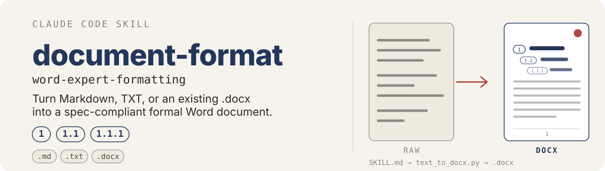
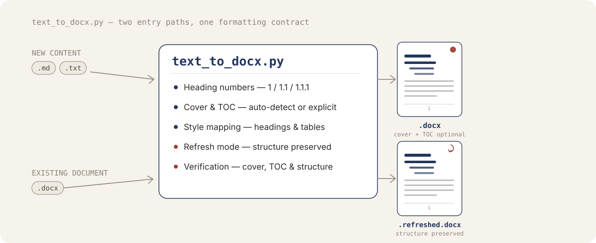

<p align="center">
  
</p>

# document-format

这个仓库的 README 只描述 `skills/` 目录下的技能。当前主要技能是 `skills/word-expert-formatting`，它是一个自定义 Claude Code skill，用于格式化中文 Word 内容，并支持把 Markdown 或纯文本本地生成 `.docx`，以及对已有 `.docx` 生成刷新副本并核查。

它使用纯十进制标题编号，并且 `--auto-toc` 会插入 Word 动态目录域，而不是静态目录文本。

## 快速开始

运行依赖：
- Python 3
- `python-docx`

```bash
python3 -m pip install python-docx
```

脚本会在启动时主动执行这些检查；如果依赖缺失，会直接给出清晰错误信息并退出。现在输出文档会从空白 Word 文档直接创建，因此该工作流不再依赖本地模板 `.docx` 文件。

参考：`skills/word-expert-formatting/scripts/text_to_docx.py:3151`

执行方式：

```bash
python3 skills/word-expert-formatting/scripts/text_to_docx.py <input-file> [output.docx] [--reserve-cover] [--auto-toc] [--with-cover|--without-cover] [--cover-text <text>] [--with-toc|--without-toc] [--style-config <path>]
```

如果省略 `output.docx`，`.md` / `.markdown` / `.txt` 输入仍会生成同名 `.docx`，而 `.docx` 输入会在源文件旁边生成 `<stem>.refreshed.docx`。

<p align="center">
  
</p>

在本仓库通过 skill 驱动本地 DOCX 工作流时，应先询问：
1. 是否生成首页
2. 如果生成首页，首页文字内容是什么（手动输入；默认空）
3. 是否生成目录页

skill 会把这些回答当作本次运行的显式决策：
- 生成首页 + 输入非空文字：把第一条非空行渲染为首页标题，后续非空行渲染为居中的公司名 / 日期等元信息
- 生成首页 + 文字为空：生成空白占位首页
- 不生成首页：本次运行同时关闭自动封面识别与占位封面插入；对已有 `.docx`，这也意味着现有首页区域会被完全冻结，不允许任何首页区域格式、section、footer 或页码改动
- 目录是否生成：每次都询问，再映射为本次脚本调用参数；当首页区域被冻结时，目录处理必须限制在检测到的正文边界之后

参考：
- `skills/word-expert-formatting/SKILL.md:127`
- `skills/word-expert-formatting/scripts/text_to_docx.py:2634`

### 脚本当前会做什么

脚本当前会：
- 接收 `.md`、`.markdown`、`.txt` 和 `.docx`
- 处理标题、段落、列表、表格、代码块、页脚页码和简单封面
- 渲染 Markdown 行内强调（加粗/斜体/行内代码/删除线）、超链接、任务列表、引用块与脚注
- 嵌入本地 `` 图片（按页宽/页高自适应缩放），并将 `mermaid` 代码块渲染为图片（本地 mmdc → draw.io CLI → mermaid.ink → 回退代码块）
- 自动剥离正文中的 emoji（代码块与行内代码原样保留）
- 使用纯十进制标题编号
- 在未检测到封面时，可通过 `--reserve-cover` 预留封面页
- 在未检测到显式目录标题时，可通过 `--auto-toc` 插入 Word 动态目录页
- 支持按单次运行显式指定首页 / 目录决策，并支持手动输入首页文字
- 从可选的 JSON 配置文件加载每级样式的字体、字号、颜色、加粗、间距、对齐，而不是使用内置默认值
- 对已有 `.docx` 生成新的刷新输出文件，而不是删除正文后重建
- 在已有 `.docx` 刷新时保留图片、表格、分页和 section 结构
- 当对已有 `.docx` 选择 `--without-cover` 时，会把现有首页区域完全冻结，并且只处理检测到的正文边界之后的内容
- 在已有 `.docx` 刷新时仍支持显式目录决策，但目录处理不得回流修改已冻结的首页区域
- 对生成型输出，或未进入首页冻结模式的已有 `.docx`，当存在封面页时使用更正式的分页模型：封面无页码，正文节从 1 开始重新编号
- 输出 `.docx` 文件

参考：`skills/word-expert-formatting/scripts/text_to_docx.py:840`

### 样式配置

每个样式条目(标题、一至九级标题、封面标题/元信息/角标、正文、引用块、表格、代码、页脚、目录标题/条目，共 20 个)的字体、字号、颜色、加粗、行距、段前段后、首行缩进、对齐，都可以不改 Python 代码直接调整。

脚本默认会在自己旁边找 `skills/word-expert-formatting/config/style.json`；如果这个文件不存在，就直接用内置的硬编码默认值，行为不变。用 `--style-config <path>` 可以指定另一个文件，或者强制要求必须存在（显式传入但文件不存在时会报错）。配置文件只需要写想改的字段，其余字段会合并（deep merge）内置默认值：

```json
{"styles": {"h1": {"color": "1F4E79", "size_pt": 20}}}
```

随包提供的 `config/style.json` 内容和现有硬编码值逐字段一致，`skills/word-expert-formatting/SKILL.md` 里的"Style matrix"表就是从它生成的——改完配置后运行 `python3 skills/word-expert-formatting/scripts/generate_style_doc.py` 重新生成表格（加 `--check` 可以只检查是否已经同步，不写文件）。

页面几何、项目符号字符、非排版颜色、标题编号方案与封面/目录识别逻辑不在这份配置里，仍然硬编码在 `text_to_docx.py` 里；`cover_title`/`cover_meta`/`cover_corner`/`toc_title` 这四个条目的 `alignment` 字段配置了也不会生效，因为它们的对齐方式在代码里被显式设置。

参考：
- `skills/word-expert-formatting/config/style.json`
- `skills/word-expert-formatting/scripts/text_to_docx.py:3691`

## 技能列表

### `word-expert-formatting`

位置：
- `skills/word-expert-formatting/SKILL.md`
- `skills/word-expert-formatting/scripts/text_to_docx.py`

用途：
- 把原始 Markdown、TXT、HTML 或较粗糙的大纲整理成适合 Word 的结构化格式
- 套用严格的中文正式文档排版模型
- 使用纯十进制标题编号
- 当输入为 `.md`、`.markdown` 或 `.txt` 时，支持本地生成 `.docx`
- 当输入为已有 `.docx` 时，支持生成刷新副本并核查

参考：`skills/word-expert-formatting/SKILL.md:1`

## 这个技能定义了什么

`skills/word-expert-formatting/SKILL.md` 定义了：
- 支持的输入形态
- 标题层级规则
- 标题编号规则
- 封面识别规则
- 标题、正文、表格和页脚页码的样式映射
- 结构化格式化结果的输出契约
- 正文段落会先清空原有缩进、行距和对齐，再按标准样式应用两端对齐与首行缩进 2 字符
- 已有 `.docx` 刷新会保留图片、表格、分页和 section 结构，而不是删除正文后重建
- 已有 `.docx` 核查同时覆盖段落版式与结构保真

参考：`skills/word-expert-formatting/SKILL.md:27`

## 当前支持的能力

当前脚本支持：
- Markdown 标题（`#` 到 `######`）
- 普通段落
- 无序列表
- 有序列表
- Markdown 表格
- 围栏代码块
- 简单封面识别
- 面向已有 `.docx` 刷新的多行封面标题块识别
- 对已有 `.docx` 的封面标题，刷新时只修正字体和字号，不改变原有标题对齐方式
- 通过 `--reserve-cover` 预留封面页
- 通过 `--with-cover` 与 `--cover-text` 显式生成首页
- 通过 `--without-cover` 显式禁止为生成型输出创建首页；对已有 `.docx` 刷新时，会原样保留原本已存在的封面
- 显式目录检测（`目录`、`TOC`、`Table of Contents`）
- 通过 `--auto-toc` 插入 Word 动态目录域
- 通过 `--with-toc` 显式生成目录
- 通过 `--without-toc` 显式禁止为生成型输出创建目录；对已有 `.docx` 刷新时，会保留原本已存在的目录
- 使用纯十进制标题编号
- 当存在封面页时采用正式分页：封面无页码，正文从 1 开始重新编号
- 保留结构的已有 `.docx` 刷新副本输出
- 面向已有 `.docx` 的封面、目录、正文、表格、编号与结构计数核查
- TXT 段落块
- 为目录生成提供最小 TXT 标题识别
- 通过 `--style-config <path>` 或默认的 `config/style.json` 覆盖每级样式，合并到内置默认值上

参考：
- `skills/word-expert-formatting/scripts/text_to_docx.py:695`
- `skills/word-expert-formatting/scripts/text_to_docx.py:822`

## XML 调试旁路

对于一些已有 `.docx` 的棘手问题，如果 Word 里的实际渲染和常规刷新结果不一致，现在还可以使用本地 XML 调试辅助脚本：

```bash
python3 skills/word-expert-formatting/scripts/debug_docx_xml.py unpack <input.docx> <output-dir>
python3 skills/word-expert-formatting/scripts/debug_docx_xml.py validate <output-dir> --original <input.docx>
python3 skills/word-expert-formatting/scripts/debug_docx_xml.py repack <output-dir> <output.docx> --original <input.docx>
```

这条路径用于 XML 层面的调试与修复，不是默认生成流程。

## 为什么在通用 DOCX 技能之外还要保留这个技能

| 维度 | 通用 DOCX 技能 | `word-expert-formatting` |
|---|---|---|
| 定位 | 底层 Office/XML 工具箱 | 面向目标文档格式的端到端生产工作流 |
| 主要职责 | 解包、检查、校验、重新打包 `.docx` | 按当前仓库格式契约生成或刷新文档 |
| 擅长场景 | XML 手术、schema 问题、relationships、tracked changes | 封面、目录、标题层级、分页、正文与表格格式 |
| 对已有 `.docx` 的处理 | 适合直接做 XML 级修复 | 适合在保留结构的前提下生成刷新副本 |
| 校验重点 | XML 合法性 | 语义层输出质量 + 结构保真 |
| 使用成本 | 更高，更适合专家级排障 | 更低，更适合日常重复使用 |
| 适用时机 | Word 渲染与 XML 不一致，或需要手术式低层修复时 | 常规格式化、刷新与核查工作 |

可以把两者理解为：
- 通用 DOCX 技能是 XML 手术工具箱
- `word-expert-formatting` 是面向本仓库目标文档格式的可重复生产线
- 推荐工作方式是：默认先走 `word-expert-formatting`，只有遇到棘手的底层问题时再回退到 XML 调试旁路

## 一个重要实现说明

skill 契约与当前 Python 脚本使用同一种标题编号方案：
- 标题统一使用 `1`、`1.1`、`1.1.1` 这类纯十进制层级编号
- 适用于技术文档、项目方案、实施计划以及类似的结构化报告

另外，`--auto-toc` 现在会插入真正的 Word 动态目录域，而不是静态文本目录项。如果在 Word 中打开后目录未立即更新，请使用 Word 的“更新目录”操作。

新增的显式开关主要用于 skill 驱动运行：
- `--with-cover` / `--without-cover` 会覆盖本次运行的自动封面识别逻辑；对已有 `.docx`，`--without-cover` 只禁止新建封面，不删除也不重排已有封面
- 单独使用 `--cover-text` 时，会隐式视为 `--with-cover`
- `--with-toc` / `--without-toc` 会覆盖本次运行的目录兜底生成逻辑；对已有 `.docx`，`--without-toc` 只禁止新建目录，不删除已有目录
- `--reserve-cover` 与 `--auto-toc` 仍保留，用于兼容直接 CLI 调用

当文档存在封面页，或者使用了 `--reserve-cover` / `--with-cover` 时，脚本现在会为正文创建独立 section，使封面不显示页码，正文重新从第 1 页开始。

参考：
- `skills/word-expert-formatting/SKILL.md:43`
- `skills/word-expert-formatting/scripts/text_to_docx.py:3455`
- `skills/word-expert-formatting/scripts/text_to_docx.py:309`

## 局限性

- 尚不支持复杂的内嵌 HTML、远程图片（会渲染为占位符）以及高度定制化的排版
- `mermaid` 代码块至少需要一种可用的渲染方式（本地 `mmdc`、draw.io CLI，或能访问 `mermaid.ink` 的网络）；如果都不可用，会回退为普通代码块而不是图片
- `SKILL.md` 是人类可读的契约文档，脚本不会解析它——格式规则的变更必须同时改动 `SKILL.md` 和 `text_to_docx.py` 才会真正影响输出

参考：`skills/word-expert-formatting/SKILL.md:327`

## 维护规则

如果某条格式规则的变更需要影响最终生成的 `.docx` 输出，请同时更新：
- `skills/word-expert-formatting/SKILL.md`
- `skills/word-expert-formatting/scripts/text_to_docx.py`

参考：`skills/word-expert-formatting/SKILL.md:165`
